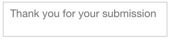

# Questionnaire Tech Test

## Task
A teacher wants to run a test for her pupils but due to Covid-19 she needs to do this remotely. Overall she has 50 questions, all with 4 possible answers. The questions are in 5 different categories of 10 questions each. The teacher should be able to control what set of questions all the students will receive, there is no requirement to see the results live but it would be a good feature if the teacher could see how many students have completed all questions in the set. The students should be able to see each of the questions in the current live set with the multiple choice answers and be able to submit these answers. They should not be able to move forward or back to any other set of questions until the teacher updates which set of questions is currently live.

## Live Deployment
[Questionnaire](https://questionnaire-tech-test.herokuapp.com/)

## User Stores (Behavioural Driven Development)

```
As a Student
So that I can access the live set of questions
I want to be able to sign in
```

```
As a Student
So that I can progress
I want to be to select an answer for each question
```

```
As a Student
So that I can finish the live set of questions
I want to be able to submit my answers
```

```
As a Teacher
So that I can provide my students with a live set of questions
I want to be able to set a category of questions
```

```
As a Teacher
So that I can keep a record of students results
I want to be able to to see which students submitted their questions or not
```

## Database

`STUDENT` table:

| field      | type              |
| ---------  | ----------------- |
| PIN        | Number            |
| FIRST_NAME | STRING            |
| FAMILY_NAME| STRING            |

`CATEGORY` table:

| field      | type              |
| ---------  | ----------------- |
| NAME       | STRING            |

`QUESTION` table:

| field             | type              |
| ---------         | ----------------- |
| CATEGORY_ID       | CATEGORY          |
| CONTENT           | STRING            |
| INCORRECT_ANSWERS | ARRAY             |
| CORRECT_ANSWER    | STRING            |

`RESULT` table:

| field         | type              |
| ---------     | ----------------- |
| STUDENT_ID    | STUDENT           |
| CATEGORY_ID   | CATEGORY          |
| SCORE         | INTEGER           |

## Mock Ups

\
\
\
\


